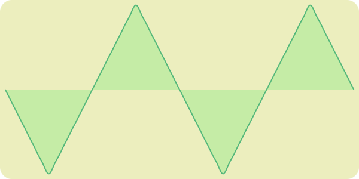

# svg-waveforms
Editor for making simple bandlimited waveform SVGs

http://irh.github.io/svg-waveforms

[][1]
[][2]
[][3]

[1]: http://irh.github.io/svg-waveforms/?data=EQbwOsDOAWCGAOBTCAuCAXATgS1gOwHMAbZYAGgjkwFsB7PbAYwGFaBXPdVCARgAYIFYNjwA3RJnSIAJt2AAzWEUikhjAJ6MSrDl2BpgAJkERa4zJFjV4REQTnHyESFloBrRAHVs09NAcmUK4erES0mHIAxACsACwARgAcAOywgfLYREQA8vCwjNjo6nJ8AHSGjkIZWaHhUQDMAJyIAGzRPIHx+W4EmOx40rn5hcX6EGXRnd29-dK1EWPAkdKJ0tLJqhAA7j5+ci18Ak7A0IjYBNB6BvWHgdSwmAQich3HfRzSdg5HAL7AQA
[2]: http://irh.github.io/svg-waveforms/?data=EQbwOsDOAWCGAOBTCAuCkCOBXWAnZwANBHLgLYD2AdgJYDGAwhVlQC6oQDMATBMcDSoA3RLlaIAJqgBmsADaRE-OgE86cxExbtgaYLyIQKI3JFhl4cwQHMOwACx90rXBQDWiAOo0JraHYAGADoANicoF3dNCjkKXDsAYjoAdk46AIDw6Ro5OQB5eFg6GlYVQKDuAEYsnLkmWPjdCCTpTmluMMNgACMit2tXFgkCopKypuBgyuTw3rp+waoJerjEuhDuxBDOcIB3Hz87EIzw6EQaa2gdFE4M-jI8a0E7A35FiRtUSoCAX2AgA
[3]: http://irh.github.io/svg-waveforms/?data=EQbwOsDOAWCGAOBTCAuClYHcIBoJwCcBbAewDsBLAYwGESBXMgF1QgDZcIKyA3RApogAmqJgXqI8wKgE8qAG0R1GLYGmAAmTsBJ8CGIvHncA5q03bIYkgGtEAdQpCm0cwEYAdFuBSrBW0ok8iQE5gDEAAwRVFER2gBmFPLyAPLwsFQUTDLmER4AzAlJ8nTBoWoQkdEAHBpU2gBGGTYm-oxCaRlZORXAeW4A7I3NrQxkQqUh4dUALDFUHD4QmE4u5mxR2tCIFCbQqij5UVJEsAQm3LnabeOm7nHAAL7AQA
